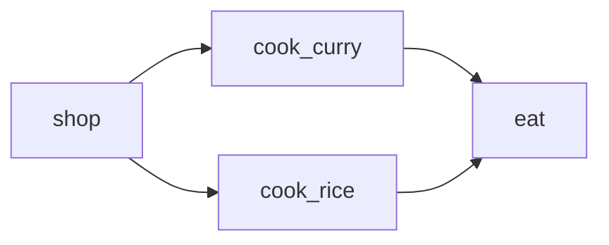

# Curry Diamond

The Curry Diamond is an example that is also used for integration testing.

The example defines a DAG of stages that model shopping for, cooking, and
eating some curry. The DAG looks like this:



The example is organized into a `lib` directory which contains the scripts that
define each stage.
```bash
$ tree
.
└── lib
    └── dinner
        ├── anyform.libsonnet
        ├── common.sh
        ├── cook_curry
        │   └── ctl
        ├── cook_rice
        │   └── ctl
        ├── eat
        │   └── ctl
        └── shop
            └── ctl
```

and it contains "deployment" directories (`prod/*`) that point at `lib` but
override configuration as appropriate for the "deployment".  These would typical
be clusters, something like "eu-north-1", but in the case of the curry example,
they are different nights of the week which will have slightly different curry
flavors.
```bash
.
└── prod
    ├── friday
    │   └── anyform.jsonnet
    └── tuesday
        └── anyform.jsonnet
```

## Playing with the example

Bring up the tuesday "deployment" of the curry diamond "infrastructure".
```bash
$ cd prod/tuesday
$ ls
anyform.jsonnet
$ anyform up
$ ls
anyform.jsonnet  genfiles  output
```

Now take a look at the `output` and `genfiles` directories that were created:
- `genfiles` contains files that shouldn't be checked into version control but
may be helpful while debugging.
- `output` contains files that should be checked into version control.

The comments in the following block provide additional information about the
contents of these directories.
```bash
prod/tuesday/
├── anyform.jsonnet  # <-- The configuration file for this "deployment".
├── genfiles
│   ├── config.json  # <-- The output of jsonnet after anyform ran it on the
│   ├── cook_curry   #     configuration file above. Stages have access to this.
│   │   ├── logs
│   │   │   └── stdout_stderr  # <-- Combined stdout and stderr of the stage.
│   │   ├── stamp              #     Note the helpful log prefixes on each line.
│   │   │   └── ctl
│   │   └── state
│   ├── cook_rice
│   │   ├── logs
│   │   │   └── stdout_stderr
│   │   ├── stamp    # <-- The result of stamping the lib/dinner/STAGE_NAME
│   │   │   └── ctl  #     directories using gomplate
│   │   └── state
│   ├── eat
│   │   ├── logs
│   │   │   └── stdout_stderr
│   │   ├── stamp
│   │   │   └── ctl
│   │   └── state    # <-- The contents and modification time of this file are
│   └── shop         #     used to determine if "up/down" are already up-to-date
│       ├── logs     #     relative to the conifg and stage implementation files
│       │   └── stdout_stderr
│       ├── stamp
│       │   └── ctl
│       └── state
└── output
    ├── cook_curry
    │   └── output.txt   # <-- Output of the cook_curry stage. Output
    ├── cook_rice              can be in JSON, text, or any format.
    │   └── output.txt
    ├── nomnom.txt       # <-- Output of the eat stage, using a subdir
    └── shop             #     is recommended but not required.
        └── output.json
```

## Running the tests

Just do the following in this directory:
```bash
mako
```

Currently, these tests are also used in CI/CD while creating a release.
